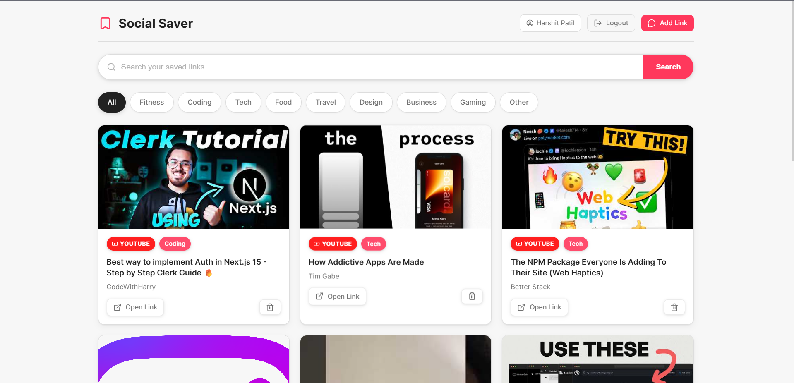

# Social Saver


Save links from Instagram, YouTube, Twitter, and blogs — organised by AI.

---

##  Interface

### Dashboard



### Chat Window


### AI Summary


---

##  Overview

This project provides a system for saving and organizing links from multiple platforms.
It focuses on structured storage and AI-assisted organization of saved content.

---

##  Setup

### 1. Create a `.env` file

```
SECRET_KEY=your_random_secret_key
OPENAI_API_KEY=your_openai_api_key
TWILIO_ACCOUNT_SID=your_twilio_sid
TWILIO_AUTH_TOKEN=your_twilio_auth_token
TWILIO_WHATSAPP_NUMBER=whatsapp:+14155238886

# PostgreSQL — leave blank to use local SQLite
# DATABASE_URL=postgresql://avnadmin:<password>@<host>:<port>/defaultdb?sslmode=require
```

On Render: add `DATABASE_URL` as an Environment Variable using your Aiven connection string.
Locally: leave it unset — SQLite is used automatically.

---

### 2. Install dependencies

```bash
pip install -r requirements.txt
```

---

### 3. Start the app

```bash
uvicorn app.main:app --reload --port 8000
```

Open:
http://localhost:8000

---

##  Configuration Notes

* Uses SQLite by default when `DATABASE_URL` is not provided
* Supports PostgreSQL via environment configuration
* External services require valid API keys

---

##  Purpose

The repository demonstrates:

* Link storage and retrieval workflow
* Integration with external APIs
* AI-based processing for organizing saved content
* Backend service setup and configuration

---
